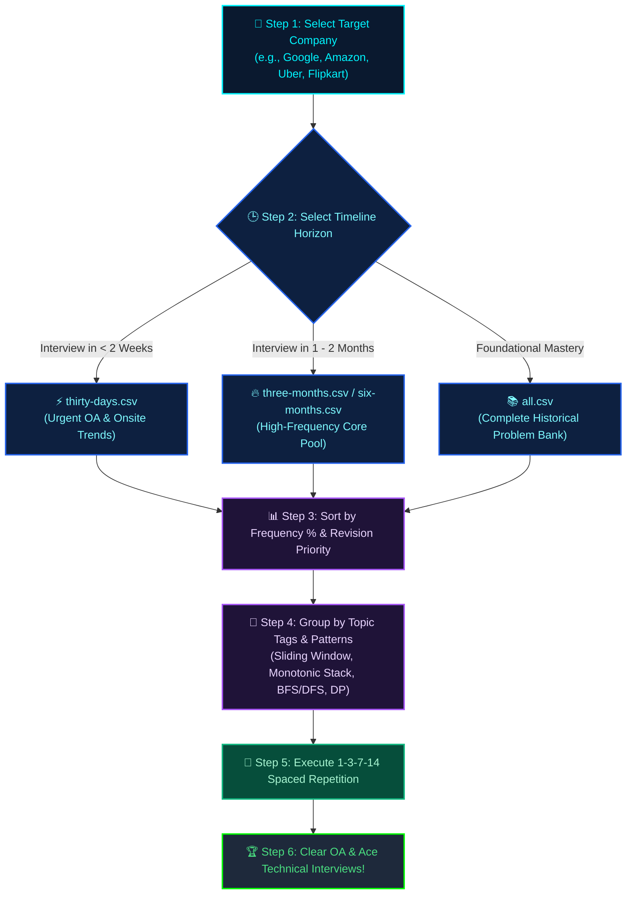

<div align="center">


# 🩺 DSA Doctor • [dsadoctor.com](https://dsadoctor.com)

### 🎯 The Official Platform for DSA Doctor (dsadoctor.com) — Company-Wise LeetCode Interview Preparation Vault & Diagnostic Engine

<p align="center">
  <a href="https://git.io/typing-svg">
    
  </a>
</p>

<!-- Core Badges -->
<p align="center">
  <a href="https://dsadoctor.com"></a>
  <a href="#-target-company-directory"></a>
  <a href="#-repository-at-a-glance"></a>
  <a href="LICENSE"></a>
</p>

<!-- Quick Navigation Bar -->
<p align="center">
  <a href="https://dsadoctor.com">🌐 <b>dsadoctor.com</b></a> •
  <a href="#-core-philosophy">💡 <b>Philosophy</b></a> •
  <a href="#-repository-at-a-glance">📊 <b>Metrics</b></a> •
  <a href="#-visual-diagnostic-pipeline">🗺️ <b>Diagnostic Flow</b></a> •
  <a href="#-target-company-directory">🏢 <b>Companies</b></a> •
  <a href="#-dataset-anatomy--schema">📑 <b>Schema</b></a> •
  <a href="#-battle-tested-study-sprints">⏱️ <b>Sprints</b></a> •
  <a href="#-frequently-asked-questions-faq">❓ <b>FAQ & SEO</b></a> •
  <a href="#-founder--creator">👨‍💻 <b>Founder</b></a>
</p>

<br />

**Welcome to DSA Doctor (also known as DSADoctor, DSA-Doctor, or dsadoctor.com) — the premier data-driven coding interview intelligence platform.**  
*Diagnose interview patterns. Practice with surgical precision. Secure your dream software engineering offer.*

</div>


## 💡 Core Philosophy


> [!IMPORTANT]
> **Grinding 1,000+ random LeetCode problems does NOT guarantee an interview offer.**
> 
> Blindly solving problems leads to cognitive burnout, low retention, and failure when interviewers present slight variations. Every tech company has an algorithmic signature—a core set of data structures, problem difficulty bands, and pattern archetypes they repeatedly test during Online Assessments (OAs) and technical rounds.
>
> **DSA Doctor** (**DSADoctor** / **dsa-doctor**), hosted officially at **[dsadoctor.com](https://dsadoctor.com)**, provides a data-driven diagnostic approach: filter real LeetCode questions by **Target Company**, **Recency (30 Days to All-Time)**, and **Relative Frequency %**, backed by pattern recognition tags and revision priority markers.

<br />


<!-- --- -->

<!-- ## 📊 Repository at a Glance

<div align="center">

| 🏢 Metric | 📦 Coverage / Specification |
| :--- | :---: |
| **Total Company Directories** | `657 Folders` |
| **Companies with Complete Datasets** | `654 Companies` |
| **Curated CSV Datasets** | `1,648 Files` |
| **Indexed Problem-Company Mappings** | `17,641+ Entries` |
| **Recency Partitions** | `30-Days` • `3-Months` • `6-Months` • `6+ Months` • `All-Time` |
| **Dataset Format** | Universal High-Speed Portable `.csv` |
| **Enriched Metadata Fields** | Topic Tags, Pattern Type, Revision Priority, Frequency %, Acceptance % |
| **Interactive Companion Platform** | [Web App Live on GitHub Pages](https://kali-prem.github.io/leetcode-company-wise-interview-questions/) |

</div> -->

<p align="right"><a href="#-dsa-doctor--dsadoctorcom"></a></p>


## 🗺️ Visual Diagnostic Pipeline


Follow this proven tactical pipeline to prepare systematically for any upcoming assessment or technical interview:



<p align="right"><a href="#-dsa-doctor--dsadoctorcom"></a></p>


## 🏢 Target Company Directory


Jump straight into your target company's curated question bank. Below is a categorized directory of premier hiring companies available in this repository:

<div align="center">

### 🌟 FAANG & Tier-1 Tech Giants
[Amazon](amazon/) • [Google](google/) • [Microsoft](microsoft/) • [Meta](meta/) • [Apple](apple/) • [Netflix](netflix/)

---

### 🚀 High-Growth & Global Product Leaders
[Uber](uber/) • [Airbnb](airbnb/) • [Stripe](stripe/) • [Atlassian](atlassian/) • [Adobe](adobe/) • [Salesforce](salesforce/) • [LinkedIn](linkedin/) • [Spotify](spotify/) • [TikTok](tiktok/) • [PayPal](paypal/)

---

### 🏦 FinTech, Wall Street & Quant Powerhouses
[Citadel](citadel/) • [Two Sigma](two-sigma/) • [Goldman Sachs](goldman-sachs/) • [Morgan Stanley](morgan-stanley/) • [DE Shaw](de-shaw/) • [Bloomberg](bloomberg/) • [Tower Research](tower-research/)

---

### 🇮🇳 Indian Tech Unicorns & Market Leaders
[Flipkart](flipkart/) • [Swiggy](swiggy/) • [Zomato](zomato/) • [Razorpay](razorpay/) • [PhonePe](phonepe/) • [Paytm](paytm/) • [Zepto](zepto/) • [Walmart Labs](walmart-labs/) • [Intuit](intuit/)

---

### ☁️ Cloud, Enterprise & AI Innovators
[NVIDIA](nvidia/) • [Snowflake](snowflake/) • [Datadog](datadog/) • [Palantir](palantir/) • [Cisco](cisco/) • [Oracle](oracle/) • [ServiceNow](servicenow/) • [VMware](vmware/) • [Qualcomm](qualcomm/) • [Intel](intel/)

</div>

> [!TIP]
> **Looking for a specific company among all 657 directories?**  
> Use your editor's Quick File Open (`Ctrl + P` on Windows/Linux, `Cmd + P` on macOS) and type the company name (e.g., `goldman-sachs/thirty-days.csv`), or explore using the [Interactive Web Dashboard](https://kali-prem.github.io/leetcode-company-wise-interview-questions/).

---

### ⚖️ The Paradigm Shift: Blind Grind vs. DSA Doctor

| Dimension | ❌ Traditional Blind Grinding | 🩺 The DSA Doctor Framework |
| :--- | :--- | :--- |
| **Strategy** | Solving whatever problem appears on the daily page | Targeted problem sets extracted from verified company interview rounds |
| **Recency Relevance** | Solving questions popular in 2018 that are no longer asked | Pinpoint questions reported in the **last 30 days, 3 months, or 6 months** |
| **Time Investment** | 500+ unstructured hours with diminishing returns | **80% faster preparation** by attacking top 20% high-frequency questions |
| **Solving Approach** | Memorizing code syntax for individual problems | Identifying underlying **Patterns** (Two Pointers, Sliding Window, Monotonic Stack, etc.) |
| **Retention** | Forgetting solutions within 2 weeks | Structured **1-3-7-14 Day Spaced Repetition Engine** |
| **Readiness** | Panic during unexpected OA problem types | Total confidence backed by real interview frequency data |

<p align="right"><a href="#-dsa-doctor--dsadoctorcom"></a></p>


## 📑 Dataset Anatomy & Schema


Each company folder contains structured CSV files partitioned by recency windows, giving you precise control over your preparation timeline:

```text
leetcode-company-wise-interview-questions/
├── amazon/
│   ├── thirty-days.csv              # ⚡ Last 30 days: active OA / interview questions
│   ├── three-months.csv             # 🔥 Last 90 days: trending interview staples
│   ├── six-months.csv               # ⚖️ Last 180 days: high-confidence preparation pool
│   ├── more-than-six-months.csv     # 🏛️ Older questions: recurring algorithmic archetypes
│   └── all.csv                      # 📚 Complete historical archive for the company
├── google/
│   ├── thirty-days.csv
│   ├── three-months.csv
│   └── ...
└── ... (657 total company folders)
```

<br />

<!-- ### 🏷️ Complete Schema Specification

Every CSV dataset is standardized with enriched analytical attributes:

| Field Header | Data Type | Diagnostic Value | Practical Prep Usage |
| :--- | :---: | :--- | :--- |
| `ID` | Integer | LeetCode Problem ID | Direct reference in LeetCode search and tracking sheets |
| `URL` | String | Full LeetCode Link | One-click access directly to the coding problem workspace |
| `Title` | String | Official Problem Name | Easy cross-referencing with discussion forums and editor trackers |
| `Difficulty` | Enum | `Easy` \| `Medium` \| `Hard` | Helps calibrate your pace; filter by Medium/Hard for Tier-1 firms |
| `Acceptance %` | Percentage | Community Acceptance Rate | Indicates implementation trickiness and edge-case complexity |
| `Frequency %` | Percentage | Relative Interview Occurrence | **Primary sorting metric:** higher % indicates higher interview probability |
| `Topic Tags` | String | Primary DSA Categories | Groups problems by DSA concept (e.g., *Graphs, Trees, DP, Arrays*) |
| `Pattern` | String | Algorithmic Solving Blueprint | Identifies pattern archetypes (*Two Pointers, Sliding Window, Monotonic Stack*) |
| `Revision Priority`| Enum | `High` \| `Medium` \| `Low` | Triage label indicating what must be revised before interview day |
| `Notes` | String | Diagnostic Guidance | Short strategic cues on how to approach and master the problem |

<br /> -->

### 🎯 The Optimal Practice Hierarchy

When time is constrained, prioritize problems following this formula:

```text
High Frequency + Recent (30d / 3m) + Medium Difficulty
   ▲
   │  (Solve First: Greatest ROI for FAANG / Tier-1 interviews)
   ▼
High Frequency + Recent + Easy Difficulty
   ▲
   │  (Warm up & speed-run fundamentals)
   ▼
High Frequency + Older Archive (6m / More-than-six-months)
   ▲
   │  (Solidify foundational patterns)
   ▼
Low Frequency + Hard Difficulty
   ▲
   │  (Only after core patterns are mastered; for bar-raiser rounds)
```

<p align="right"><a href="#-dsa-doctor--dsadoctorcom"></a></p>


## ⏱️ Battle-Tested Study Sprints


Whether you have 7 days before an emergency assessment or a full month for campus placements and job switching, execute these structured plans:

### ⚡ Sprint A: The 7-Day Emergency Sprint (Upcoming Interview)

Designed for rapid triage when an Online Assessment or technical screen is scheduled for next week.

| Day | Focus Area | Target Dataset | Daily Output Goal |
| :---: | :--- | :--- | :--- |
| **Day 1** | High-Frequency Quick Wins | `thirty-days.csv` | 6 Easy + 2 Medium (Speed & confidence warmup) |
| **Day 2** | Arrays, Strings & Two Pointers | `thirty-days.csv` + `three-months.csv` | 5 Medium (Focus on HashMaps, Prefix Sums, Sliding Window) |
| **Day 3** | Trees & Binary Search | `three-months.csv` | 5 Medium (DFS/BFS traversals, LCA, Rotated Array Binary Search) |
| **Day 4** | Linked Lists, Stacks & Queues | `three-months.csv` | 5 Medium (Monotonic stack, In-place list reversal, Fast/Slow pointers) |
| **Day 5** | Graphs & Dynamic Programming | `six-months.csv` | 4 Medium (Topological Sort, Dijkstra, 1D/2D Memoization) |
| **Day 6** | Company-Specific Bar Raisers | `all.csv` (High Frequency) | 2 Hard + 3 Medium (Top frequency signature questions) |
| **Day 7** | Timed Mock Simulation & Revision | Missed / Flagged Questions | 3 Problems under 45-min timer + behavioral review |

<br />

### 🗓️ Sprint B: The 30-Day Comprehensive Placement Blueprint

Designed for thorough preparation for product-based company hiring drives and career transitions.

| Week | Phase | Strategic Objective | Key Focus Topics |
| :---: | :--- | :--- | :--- |
| **Week 1** | **Foundations & Core Linear Patterns** | Rebuild speed and algorithmic fluency | Arrays, Two Pointers, Sliding Window, Prefix Sum, Hashing, Linked Lists |
| **Week 2** | **Hierarchical Structures & Search** | Master non-linear data structures | Binary Trees, BST, Binary Search on Answer Space, Heaps / Priority Queues |
| **Week 3** | **Advanced Algorithms & Optimizations** | Conquer complex company favorites | Graphs (BFS/DFS/DSU), Backtracking, 1D/2D Dynamic Programming, Greedy |
| **Week 4** | **Company Sprints & Mock Simulations** | Real interview simulation under pressure | Solve top 40 problems from target company `three-months.csv` + timed mocks |

---

<!-- ## 🔁 The 1-3-7-14 Spaced Repetition Engine

Solving a problem once is almost useless if you can't reproduce the optimal approach 3 weeks later in front of an interviewer. Use the **1-3-7-14 Spaced Repetition Engine**:

```
Problem Solved
     │
     ├── 🕒 Day 1 (24 Hours Later): Re-sketch intuition and edge cases on paper (5 mins)
     │
     ├── 🕒 Day 3: Code the solution from scratch with zero hints
     │
     ├── 🕒 Day 7: Explain the time & space complexity out loud as if in an interview
     │
     └── 🕒 Day 14: Re-solve a harder variation or solve under strict 20-minute timer
```

--- -->

<p align="right"><a href="#-dsa-doctor--dsadoctorcom"></a></p>


## ⚡ Quick Start & Usage


### 1. 🌐 Instant Access via Live Web App
Visit the interactive dashboard to search, filter, and inspect roadmaps directly in your browser:  
👉 **[Open DSA Doctor Web App](https://kali-prem.github.io/leetcode-company-wise-interview-questions/)**

<!-- ### 2. 📊 Import into Spreadsheets (Notion / Google Sheets / Excel)
1. Navigate to your target company folder (e.g., `amazon/`).
2. Open `thirty-days.csv` or `three-months.csv`.
3. Import the raw CSV into **Google Sheets**, **Excel**, or **Notion Databases** to create your personal custom tracking dashboard. -->

<!-- ### 3. 🐍 Command-Line & Data Science Filtering

Filter high-frequency questions directly using Python and Pandas:

```python
import pandas as pd

# Load 30-day recent Amazon interview questions
df = pd.read_csv("amazon/thirty-days.csv")

# Filter for High Priority Medium/Hard problems sorted by Frequency
priority_problems = df[
    (df["Revision Priority"] == "High") & (df["Difficulty"].isin(["Medium", "Hard"]))
].sort_values(by="Frequency %", ascending=False)

# Display top 10 must-solve questions
print(priority_problems[["ID", "Title", "Difficulty", "Pattern", "Frequency %"]].head(10))
```

Or query in the terminal using standard bash tools:

```bash
# View top 15 highest frequency questions for Google
head -n 1 google/three-months.csv && tail -n +2 google/three-months.csv | sort -t',' -k6 -nr | head -n 15
```

--- -->

<!-- ## 🛠️ Personal Tracker Template

Build your own customized `progress.md` file in your personal branch to monitor your preparation velocity:

```markdown
# 🎯 My Interview Prep Log

| Target Company | Problem | Difficulty | Pattern | Date Solved | Review (Day 3) | Review (Day 7) | Status |
| :--- | :--- | :---: | :--- | :---: | :---: | :---: | :---: |
| **Amazon** | [200. Number of Islands](https://leetcode.com/problems/number-of-islands/) | `Medium` | BFS / DFS Grid | 2026-09-05 | 🔲 | 🔲 | ✅ Solved |
| **Google** | [42. Trapping Rain Water](https://leetcode.com/problems/trapping-rain-water/) | `Hard` | Two Pointers | 2026-09-06 | 🔲 | 🔲 | 🔄 Revising |
| **Microsoft**| [146. LRU Cache](https://leetcode.com/problems/lru-cache/) | `Medium` | Doubly LL + Map | 2026-09-07 | 🔲 | 🔲 | 🕒 Scheduled |
```

--- -->

<p align="right"><a href="#-dsa-doctor--dsadoctorcom"></a></p>


## 👨‍💻 Founder & Creator


<div align="center">


### **Prem Kumar**
*Software Engineer • Full-Stack Developer • Cybersecurity Enthusiast • Creator of DSA Doctor*

<p align="center">
  <a href="https://dsadoctor.com" target="_blank"></a>
  <a href="https://kali-prem.github.io/Portfolio/" target="_blank"></a>
  <a href="https://github.com/Kali-Prem" target="_blank"></a>
  <a href="https://www.linkedin.com/in/kali-prem" target="_blank"></a>
  <a href="https://leetcode.com/u/Prem_Kumar01" target="_blank"></a>
  <a href="founder/"></a>
</p>

*"Building tools that empower developers to prepare with intention, eliminate interview guesswork, and secure life-changing opportunities."*

</div>

<p align="right"><a href="#-dsa-doctor--dsadoctorcom"></a></p>


## ❓ Frequently Asked Questions (FAQ)


### 🔍 What is DSA Doctor (dsadoctor.com)?
**DSA Doctor** (also searched as **DSADoctor**, **dsa doctor**, **dsa-doctor**, or **dsadoctor.com**) is a proprietary algorithmic diagnostic engine and interview preparation platform created by **Prem Kumar**. It organizes and curates over 17,640+ verified coding interview questions across 650+ tech companies into structured, recency-aware problem banks.

### 🌐 Where can I access the official DSA Doctor website?
The official web application is live at **[dsadoctor.com](https://dsadoctor.com)**. You can also access the interactive companion mirror at [kali-prem.github.io/leetcode-company-wise-interview-questions](https://kali-prem.github.io/leetcode-company-wise-interview-questions/).

### 🎯 How does DSA Doctor (dsadoctor) help crack coding interviews?
Instead of grinding random problems, **DSA Doctor** allows you to:
- Target specific companies (e.g., Google, Amazon, Microsoft, Uber, Flipkart).
- Filter questions by recency: `thirty-days.csv` for urgent OAs, `three-months.csv` for interview prep, and `all.csv` for deep coverage.
- Focus on high-frequency questions first to get maximum preparation ROI in minimum time.
- Identify algorithmic patterns (Two Pointers, Sliding Window, Graphs, DP) rather than memorizing solutions.

### 💸 Can I access DSA Doctor (dsadoctor.com) for free?
Yes, **DSA Doctor (dsadoctor.com)** is freely accessible for individual, personal interview preparation. However, all source code, software, datasets, and compilations are **Proprietary with All Rights Reserved**. Copying, redistributing, scraping, sublicensing, or republishing any portion of this repository for commercial or non-commercial purposes without express prior written permission is strictly prohibited.

<p align="right"><a href="#-dsa-doctor--dsadoctorcom"></a></p>


## 🤝 Contributing


We welcome community contributions! If you recently interviewed at a company or noticed new recurring questions:

1. 🍴 **Fork the Repository** on GitHub.
2. 🌿 **Create your Feature Branch** (`git checkout -b feature/update-company-questions`).
3. 🛠️ **Update or Add Datasets** adhering to the standard schema (`ID, URL, Title, Difficulty, Acceptance %, Frequency %, Topic Tags, Pattern, Revision Priority, Notes`).
4. 🧹 **Verify CSV Formatting** ensuring clean commas, quotes, and no corrupted rows.
5. 🚀 **Submit a Pull Request** with details of recent interview trends.

> [!NOTE]
> By submitting a pull request, issue, or contribution, you agree that your contribution is provided to the Copyright Holder and incorporated into this proprietary project under these terms, without granting any ownership or reuse rights to third parties.

<p align="right"><a href="#-dsa-doctor--dsadoctorcom"></a></p>


## ⚠️ Disclaimer


This repository is maintained independently for educational and career-preparation purposes. All problem titles, identifiers, and conceptual frameworks are referenced from publicly accessible interview experiences, community submissions, and public technical preparation sources.

*LeetCode is a registered trademark of LeetCode LLC. This repository is not affiliated with, endorsed by, or sponsored by LeetCode or any of the corporate organizations listed herein.*

<p align="right"><a href="#-dsa-doctor--dsadoctorcom"></a></p>


## 📜 License & Copyright


**Copyright © 2026 Prem Kumar. All Rights Reserved.**

This repository, including all source code, software, CSV datasets, diagnostic algorithms, documentation, and design assets, is **strictly proprietary and confidential**. This project is **NOT open source**.

- **All Rights Reserved**: No permission is granted to copy, clone, reproduce, modify, distribute, sublicense, publish, sell, or reuse this source code, datasets, or substantial portions of it without prior written permission from the Copyright Holder (Prem Kumar).
- **GitHub Visibility Notice**: Viewing this repository on GitHub or accessing it via GitHub Pages does not grant any rights or license to reuse, fork, copy, or redistribute the code or data.
- **Commercial & Non-Commercial Use Prohibited**: Both commercial exploitation and non-commercial redistribution or mirroring are strictly prohibited without prior written authorization.
- **Personal Preparation**: You are permitted solely to view and study the materials for your personal, individual technical interview preparation through official interfaces.

For licensing inquiries, permissions, or corporate use requests:  
👉 **Contact:** [Prem Kumar](https://github.com/Kali-Prem) | [Official Platform](https://dsadoctor.com)

<p align="right"><a href="#-dsa-doctor--dsadoctorcom"></a></p>


## 🔍 Google Search & SEO Index for DSA Doctor (dsadoctor.com)


To help developers, students, and engineers easily discover this platform on Google and search engines across all spelling and spacing variations:

<details open>
<summary><b>📌 Verified Search Terms & Discovery Index</b></summary>

<br />

- **🌐 Exact Brand & Domain Variations**:  
  `dsadoctor` • `dsa doctor` • `dsa-doctor` • `dsa_doctor` • `dsadoctor.com` • `https://dsadoctor.com` • `http://dsadoctor.com` • `www.dsadoctor.com` • `dsadoctor com` • `dsa doctor com` • `dsadoctor website` • `dsa doctor website` • `dsadoctor official` • `dsadoctor platform` • `dsadoctor github` • `dsa doctor github` • `dsadoctor web app` • `dsa doctor online`

- **👨‍💻 Founder & Creator Search Terms**:  
  `prem kumar dsadoctor` • `prem kumar dsa doctor` • `kali-prem dsadoctor` • `kali-prem dsa doctor` • `dsadoctor prem kumar` • `dsa doctor prem kumar` • `dsadoctor founder` • `dsa doctor creator`

- **📚 DSA Sheet & Preparation Keywords**:  
  `dsadoctor sheet` • `dsa doctor sheet` • `dsadoctor dsa sheet` • `dsa doctor dsa sheet` • `dsadoctor roadmap` • `dsa doctor roadmap` • `dsadoctor leetcode` • `dsa doctor leetcode` • `dsadoctor company wise` • `dsa doctor company wise` • `dsadoctor company wise questions` • `dsa doctor interview prep` • `dsadoctor 7 day sprint` • `dsadoctor 30 day blueprint` • `dsadoctor study plans` • `dsa doctor frequency list` • `dsadoctor must solve`

- **🏢 Company-Wise Search Terms**:  
  `dsadoctor amazon` • `dsadoctor google` • `dsadoctor microsoft` • `dsadoctor meta` • `dsadoctor apple` • `dsadoctor netflix` • `dsadoctor uber` • `dsadoctor flipkart` • `dsadoctor goldman sachs` • `dsadoctor bloomberg` • `dsadoctor citadel` • `dsadoctor swiggy` • `dsadoctor zomato` • `dsadoctor razorpay`

- **🏷️ Industry & Standard LeetCode Tags**:  
  `leetcode-company-wise` • `leetcode-company-wise-questions` • `leetcode-company-wise-problems` • `leetcode-company-wise-solutions` • `leetcode-interview-preparation` • `leetcode-interview-prep` • `leetcode-dsa-sheet` • `leetcode-dsa-practice` • `leetcode-important-questions` • `leetcode-questions-for-interviews` • `leetcode-questions-with-solutions` • `coding-interview-questions` • `coding-interview-problems` • `dsa-interview-questions` • `dsa-interview-preparation` • `software-engineering-interview-questions` • `faang-interview-questions` • `faang-coding-interview` • `top-coding-interview-questions` • `most-asked-coding-questions` • `company-wise-coding-questions` • `online-assessment-questions`

</details>

<br />

<div align="center">

### ⭐ If DSA Doctor assists you in clearing your technical interviews, leave a star!

**Stay Disciplined • Master Patterns • Claim Your Engineering Offer 🚀**

<br />

<a href="#-dsa-doctor--dsadoctorcom">
  
</a>

<br /><br />


</div>
